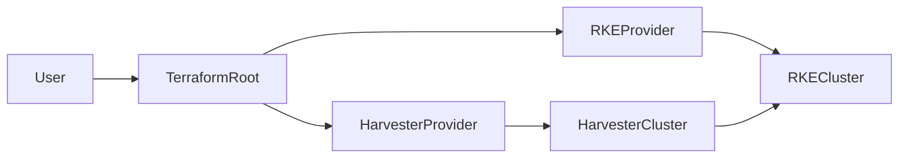

# Module: harvester-rke-cluster

Creates Harvester virtual machines and uses the [RKE Terraform provider](https://registry.terraform.io/providers/rancher/rke/latest) to install and manage an RKE (RKE1) Kubernetes cluster on them.

**Node model:** A single `harvester_virtualmachine` resource is used. Every node runs all three RKE roles: **etcd**, **controlplane**, and **worker**. Set `node_count` to scale the cluster (e.g. 1 for single-node, 3 for a small HA cluster).

## How it works

1. **Harvester provider** creates `node_count` VMs with cloud-init that installs Docker and configures SSH.
2. **RKE provider** connects to each VM via SSH and installs Kubernetes (RKE1) in Docker containers, with each node running etcd, controlplane, and worker.



## Harvester provider configuration

This module relies on the official `harvester/harvester` Terraform provider to talk to your Harvester cluster. The provider **must be configured in the root module** (for example, in a `providers.tf` file) before using this module or any of the examples.

A minimal configuration using a local Harvester kubeconfig looks like:

```hcl
provider "harvester" {
  kubeconfig = "~/.kube/harvester.yaml" # path to your Harvester kubeconfig
}
```

Other authentication options (such as URL/token and environment variables) are documented in the official Harvester provider docs on the Terraform Registry. Refer to those docs if you need a different auth method.

The `rancher/rke` provider is declared in the module’s `terraform` block and normally does not require additional configuration: it connects to the Harvester VMs over SSH using the `ssh_private_key_path` you pass into the module.

## Requirements

- VMs must be reachable via SSH from the machine running Terraform (same network or port forwarding).
- Set `ssh_private_key_path` to the private key that matches `ssh_public_key` (used in cloud-init).

## Kubeconfig output

Set `fetch_kubeconfig = true` to write the cluster kubeconfig to a local file. The RKE provider returns `kube_config_yaml`; the module replaces `127.0.0.1` with `kubeconfig_server` (or `server_endpoint`) so you can use the file from your workstation.

## HA and endpoint

For multi-node clusters, use a stable API endpoint:

- Set `server_endpoint` to your load balancer / VIP / DNS name.
- Set `kubeconfig_server` to the same value if you want the written kubeconfig to target that endpoint.

## Networking

If you use `wait_for_lease = true`, the VM image should have `qemu-guest-agent` (common on Harvester management networks).

## Static IP addresses

By default, nodes receive IPs from the Harvester network’s IPAM (e.g. DHCP). To assign explicit static IPs to each node, set the following variables:

- **node_ips** – List of static IPv4 addresses, one per node (index matches node index). When omitted or empty, behavior is unchanged and nodes use DHCP.
- **node_ip_prefix_length** – Prefix length for the node subnet (e.g. `24` for `/24`). Used only when `node_ips` is set. Default: `24`.
- **node_gateway** – Default gateway for the nodes. Required when `node_ips` is set.
- **node_dns_servers** – Optional list of DNS server IPs. Used only when `node_ips` is set.

Example for a 3-node cluster with static IPs:

```hcl
module "rke" {
  source = "..."

  node_count             = 3
  node_ips               = ["10.0.0.11", "10.0.0.12", "10.0.0.13"]
  node_ip_prefix_length  = 24
  node_gateway           = "10.0.0.1"
  # node_dns_servers     = ["10.0.0.2"]  # optional

  # other required inputs ...
}
```

Static IPs are applied via cloud-init network config on the first interface (`eth0`). Ensure the addresses are valid for your Harvester network and do not conflict with DHCP ranges. For static-only setups you can leave `wait_for_lease = false`.

## RKE1 end of life

RKE/RKE1 reaches end of life on **July 31, 2025**. Consider migrating to RKE2 or another distribution for new clusters. See [Rancher’s announcement](https://rke.docs.rancher.com/).
